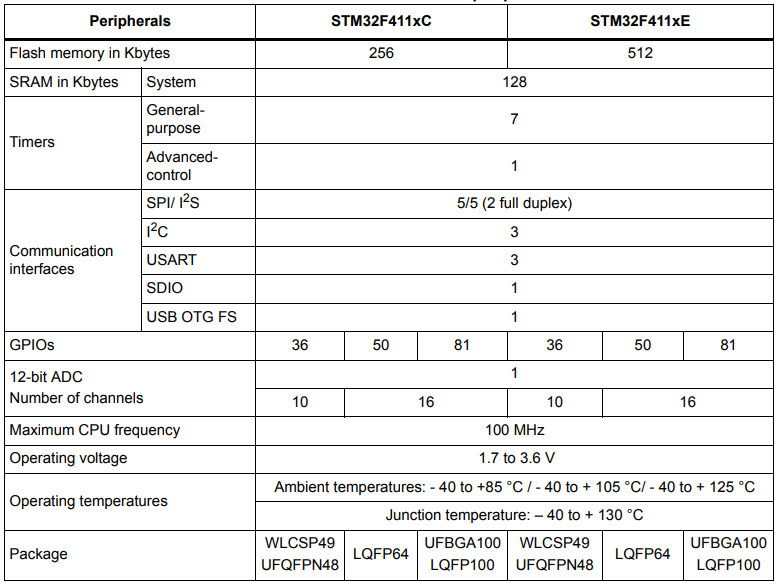

# [STM32F411](https://github.com/SoCXin/STM32F411)

 

#### [Vendor](https://github.com/SoCXin/Vendor)：[ST](https://github.com/SoCXin/ST)
#### [Core](https://github.com/SoCXin/Cortex)：[Cortex M4](https://github.com/SoCXin/CM4) 
#### [Level](https://github.com/SoCXin/Level)：100MHz /  105DMIPS

## [STM32F411描述](https://github.com/SoCXin/STM32F411/wiki) 

[STM32F411](https://github.com/SoCXin/STM32F411) 为高性能F4系列的入门产品，提供了动态功耗（运行模式）和处理性能之间的最佳平衡，即使在3 x 3 mm的小封装内也集成了大量的增值特性。

STM32F411为新型的大量数据获取模式（BAM），为数据处理进行了功耗优化，将Dynamic Efficiency提升到了一个新的水平。 BAM通过通信外设交换大量数据，同时器件的其它部分（包括CPU）可处于省电模式。

在100 MHz频率下，利用意法半导体的ART加速器，从Flash存储器执行时，STM32F411可实现FLASH零等待执行并达到125 DMIPS/339 CoreMark的性能。 DSP指令和浮点运算单元扩大了产品的应用范围。

该系列产品采用意法半导体90 nm工艺和ART加速器，具有动态功耗调整功能，能够在运行模式和从Flash存储器执行时实现低至100 µA/MHz的电流消耗。 停机模式下，功耗低至10 µA。

 

### [收录资源](https://github.com/SoCXin/STM32F411)

* [参考文档](docs/)
* [参考资源](src/)

### [选型建议](https://github.com/SoCXin)

[STM32F411](https://github.com/SoCXin/STM32F411)是F4系列的入门级产品，主频和配置高于[STM32F401](https://github.com/SoCXin/STM32F401)，相对[STM32F410](https://github.com/SoCXin/STM32F410)缺少DAC和TRNG，多USB.

###  [SoC芯平台](http://www.SoC.Xin) 

