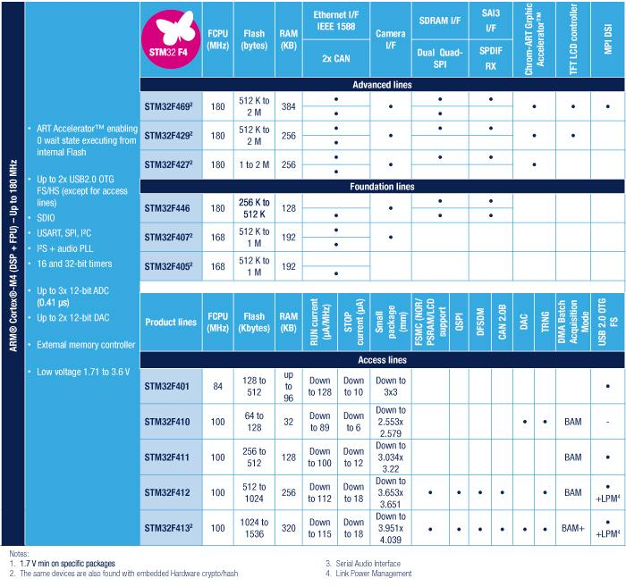

# [STM32F4](https://github.com/mcuyun/STM32F4) 
 
#### 厂商：[ST](https://github.com/sochub/ST) 
#### 架构：[Cortex M4](https://github.com/sochub/CM4) 
## [描述](https://github.com/sochub/STM32F4/wiki) 

以Cortex™-M4为内核的STM32F4系列高性能微控制器，其采用了90nm的NVM工艺和ART，F4系列可达到210DMIPS@168MHz，STM32F4系列微控制器集成了单周期DSP指令和FPU

 

###  [收录产品](https://github.com/sochub/STM32F4)  

* [STM32F401](https://github.com/sochub/STM32F401) 
84 MHz 105 DMIPS 
* [STM32F407](https://github.com/sochub/STM32F407) 
168 MHz 210 DMIPS 
* [STM32F427](https://github.com/sochub/STM32F429) 
180 MHz 1225 DMIPS 

### [选型建议](https://github.com/sochub)

##  [SoC资源平台](http://www.qitas.cn)   

